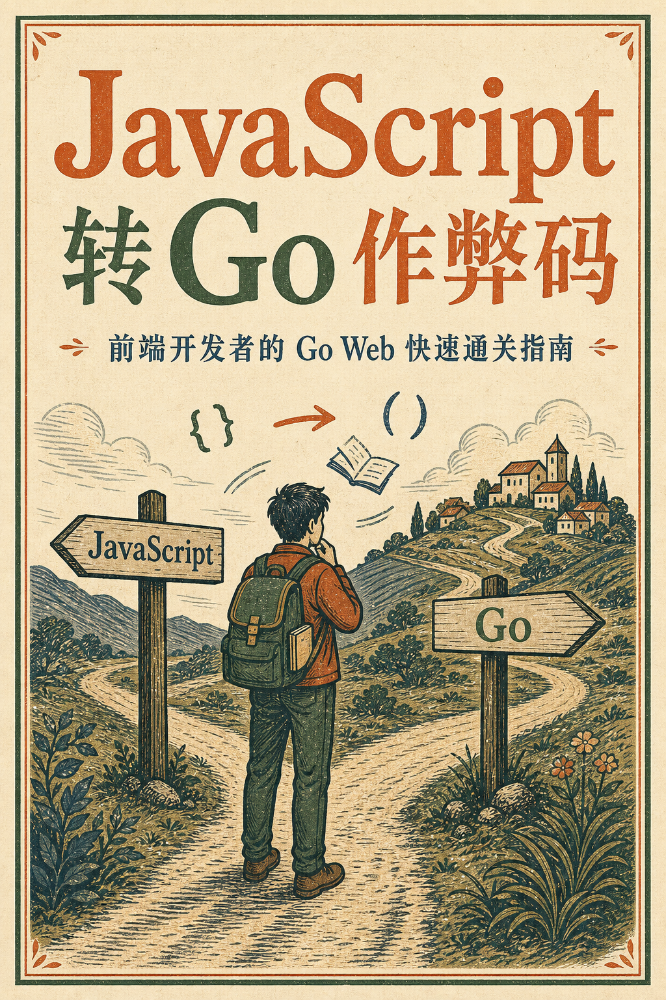

# JavaScript 转 Go 作弊码

**作弊码，顾名思义是让你快速进入一个状态的秘籍。** 所以通篇尽可能不写一句废话，适用于前端开发快速转 Go Web 后端开发成为全栈开发。

AI 时代，做任何事情效率都在提高。你只需学会快速上手，后面的事情，就交给强大的 AI 吧。

# 目录

[Language Specification](docs/language-specification.md) —— 总学习时长只需 3 小时

[Gin Web Framework](docs/gin-web-framework.md)

# 致谢

[build-web-application-with-golang](https://github.com/astaxie/build-web-application-with-golang)

Google AI Mode

[Comate](https://comate.baidu.com)

# License

Book License: [CC BY-SA 3.0 License](https://creativecommons.org/licenses/by-sa/3.0/)

Code License: [MIT License](./LICENSE)
