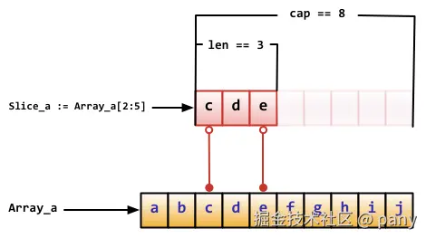
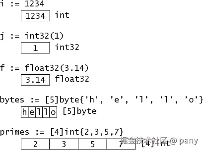
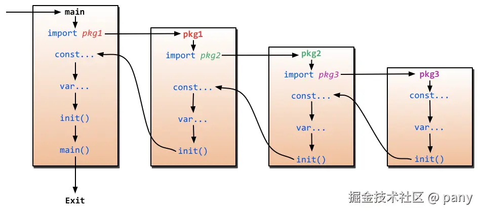

# 00（预计学习：1 分钟）

## 一句话介绍

Go 是一种较新的语言，一种并发的、带垃圾回收的、快速编译的语言。

## 语言所属

Go 属于静态强类型，而 JS 属于完全相反的动态弱类型。

Go 属于编译型语言，而 JS 属于解释型语言。


> **JS 类比**：Go 的类型检查发生在编译期，手感像给项目常开 `tsc --strict`。但 TS 的类型编译后会被擦除，Go 的类型在运行时是真实存在的（后面的反射一节会用到这一点）。

# 01（预计学习：10 分钟）

## 安装

有好几种安装方式，一般选择标准包安装方式即可：访问官方[下载地址](https://go.dev/dl/)，选择适应的系统和适用的版本。下载后双击安装包，一直点击下一步即可，非常简单。

_文章编写时，作者所安装的 Go 版本为最新的 `1.26.5`_

## 设置代理

为了国内更顺利地安装 Go Module 的包，需要设置一下代理。但需要注意该 macOS 命令仅对当前终端会话有效。

```bash
# 公共模块代理
export GOPROXY=https://goproxy.io,direct
```

Windows 环境或私有模块设置代理请继续参考 [goproxy.io](https://goproxy.io) 网站教程。

> **JS 类比**：`GOPROXY` 就是 `npm config set registry` 换的那个镜像源。

如果需要全局生效，则执行命令（以 macOS 为例）：

```bash
go env -w GOPROXY=https://goproxy.io,direct
```

## 开发工具

与前端开发一样，采用 [Visual Studio Code](https://code.visualstudio.com/) 代码编辑器即可，只需记得安装 [golang.go](https://open-vsx.org/vscode/item?itemName=golang.Go) 插件。


# 02（预计学习：15 分钟）

## hello world

国际惯例不能丢。新建一个 `main.go` 入口文件，写入以下代码：

```go
package main // 当前文件属于 main 包

import "fmt" // 导入包

func main() { // 入口函数，这个函数既没有参数，也没有返回值
    fmt.Print("Hello, World. 你好，世界。\n") // Go 天生支持任意 UTF-8 字符
}
```

包名 `main` 则表示它是一个可独立运行的包，它在编译后会产生可执行文件。除了 `main` 包之外，其它的包会生成包文件存放在构建缓存中。

> **JS 类比**：JS 没有入口函数这个概念，入口文件的顶层代码直接就跑起来了，Go 则必须把起点写成 `main` 包里的 `func main()`。另外 `fmt.Print` 对应 `process.stdout.write`，而后面常见的 `fmt.Println` 才对应 `console.log`（自动换行）。

保存代码后在终端输入下面的运行命令即可查看 `Print` 函数打印的字符串。

```bash
# 初始化 go.mod（执行一次即可）
go mod init ModuleName
# 编译并立即运行
go run .
```

## 常用命令

简单了解一下有哪些。

```bash
# 初始化 go.mod
go mod init [module name]
# 检测和清理依赖/更新依赖文件
go mod tidy
# 下载依赖文件
go mod download
# 将依赖复制到本地的 vendor 目录
go mod vendor
# 通过命令，手动修改依赖文件
go mod edit -replace github.com/go-ego/gse=/path/to/local/gse
go mod edit -replace github.com/go-ego/gse=github.com/vcaesar/gse@v0.60.0
# 或者直接在 go.mod 中添加如下替换指令，实现修改依赖文件
replace github.com/go-ego/gse => github.com/vcaesar/gse v0.60.0
# 打印依赖图
go mod graph
# 校验依赖
go mod verify
# 添加或更新包
go get package@version
# 更新包
go get -u
# 更新指定包
go get -u package
# 编译并安装可执行文件到 $GOBIN 目录（未设置 GOBIN 时为 $GOPATH/bin/）
go install
# Go 1.16+ 在模块外安装工具，必须写成 package@version 的形式
go install package@latest
# 编译并立即运行，不保留可执行文件
go run .
# 只编译，可执行文件默认留在当前目录
go build
# 移除当前源码包和关联源码包里面编译生成的文件
go clean
# 格式化代码（很多自动格式化工具底层都依赖该命令）
go fmt
# 生成并运行测试用的可执行文件
go test
# 检查代码中的可疑构造
go vet ./...
# 查看当前的环境变量
go env
# 列出当前目录的 package
go list
```

先用一张对照表建立肌肉记忆：

| Go                      | npm / 前端工具链                                                 |
| ----------------------- | ---------------------------------------------------------------- |
| `go.mod` / `go.sum`     | `package.json` / `package-lock.json`                             |
| `go mod init`           | `npm init`                                                       |
| `go mod tidy`           | `npm install` + `npm prune`（按源码里实际的 import 增删依赖）    |
| `go mod download`       | `npm ci`（只预取到全局模块缓存，没有 `node_modules`）            |
| `go get pkg@v1.2.3`     | `npm i pkg@1.2.3`                                                |
| `go mod vendor`         | 把依赖复制到项目内的 `vendor/`（类似把 `node_modules` 放进项目） |
| `go install pkg@latest` | `npm i -g pkg`                                                   |
| `go build`              | `npm run build` / `vite build`                                   |
| `go run .`              | `npx tsx index.ts`                                               |
| `go fmt`                | Prettier（内置，且几乎没有配置项可吵）                           |
| `go vet`                | ESLint（只查正确性，不管格式）                                   |
| `go test`               | Jest / Vitest（内置，测试文件叫 `xxx_test.go`）                  |

另有两处差异需要提前知道：Go 没有 `node_modules`，依赖统一缓存在 `$GOPATH/pkg/mod` 里供所有项目共用；Go 也没有 `scripts` 字段，需要串一串命令时大家一般写 `Makefile`。

## 导入导出

首字母大写的变量、函数、类型是导出的，其它包可以访问；首字母小写的不导出，只能在当前包内使用。

类比前端的 `ES Module`：大写开头相当于 `export function Parse() {}`，小写开头相当于只写 `function parse() {}` 没有 `export`。区别在于 Go 的边界是包（一个目录），不是单个文件；同一个包里的不同文件之间，小写的东西可以直接互相调用，不需要 `export`，也不需要 `import`。

> **JS 类比**：Go 的导入永远是整个包的命名空间，`import "fmt"` 相当于 `import * as fmt from "fmt"`，用的时候必须写 `fmt.Println`。没有 default export，也不能只挑一个函数导入；想换个名字用就写 `import f "fmt"`，相当于 `as f`。还有一条会让人措手不及：导入了却没使用，Go 直接编译不通过，而这在 JS 里只是 ESLint 的一个 warning。

**先记住以上内容即可。**

## 关键字

关键字不多，先瞅一眼即可。

```go
break    default      func    interface    select
case     defer        go      map          struct
chan     else         goto    package      switch
const    fallthrough  if      range        type
continue for          import  return       var
```

# 03（预计学习：60 分钟）

## 定义变量

用关键字 `var` 初始化变量 age 的值为 28，类型为 int。

```go
var age int = 28
```

有简化写法，可以省略 `var` 关键字并自动推断类型。但是请记住这种短变量声明 `:=` 只能在函数内部使用。

```go
age := 28
```

> **JS 类比**：`var` 对应的是 `let`（同样是块级作用域，Go 不存在 JS `var` 那种变量提升），`:=` 是它的省略写法，但只能写在函数内部，包级别只能用 `var`。另外声明了却没使用的局部变量会直接编译报错，同样不像 JS 只给一个 warning。

特殊字符下划线 `_`，任何赋予它的值都会被丢弃，下面表达式丢弃了 59，将 60 赋值给了变量 score。

```go
_, score := 59, 60
```

> **JS 类比**：`_` 相当于解构里的空位，`_, score := 59, 60` 就是 `const [, score] = [59, 60]`。

## 定义常量

和 JS 一样用 `const` 关键字。

```go
const Pi float32 = 3.14
```

> **JS 类比**：只有关键字一样。JS 的 `const` 锁的是绑定，所以 `const arr = []` 之后照样能 `arr.push()`；Go 的 `const` 只能用编译期可求值的常量表达式（数字、字符串、布尔等），写 `const n = 1 + 2` 是合法的，而 `const s = []int{}` 会直接编译不通过。

## 分组声明

导入语法：

```go
import "fmt"
import "os"

// 可简化为：

import (
    "fmt"
    "os"
)
```

声明变量：

```go
var i int
var pi float32
var prefix string

// 可简化为：

var (
    i      int
    pi     float32
    prefix string
)
```

## 基础数据类型

### boolean

```go
var isActive bool = true
```

### 数值类型

#### 整数

两种，有符号 `int` 和无符号 `uint`，这两种类型的长度相同，但具体长度取决于不同编译器的实现。

也有直接定义好位数的类型，比如 `int32`（别称 `rune`）和 `uint8`（别称 `byte`）。

需要注意的是，这些类型的变量之间不允许互相赋值或操作，不然会在编译时引起编译器报错。

#### 浮点数

两种，有 `float32` 和 `float64` 类型，没有 `float` 类型，默认是`float64`。

> **JS 类比**：JS 只有一个 `number`（IEEE 754 双精度），最接近 Go 的 `float64`；JS 的 `BigInt` 在 Go 里对应标准库的 `math/big`。Go 把整数拆成了一排宽度确定的类型，而且不同类型之间连相加都不允许，必须显式转换成同一种：`int64(a) + b`。

#### 复数

默认是 `complex128` 类型，也可指明 `complex64`。

```go
var c complex64 = 5 + 5i
```

### 字符串

字符串是用一对双引号 `""` 或反引号 `` ` `` `` ` `` 括起来定义。

```go
// 单行
var str1 string = ""
// 多行
str2 := `hello
    world`
```

> **JS 类比**：反引号相当于模板字符串的多行能力，但**不能插值**，Go 里没有 `${}`，拼字符串要用 `fmt.Sprintf("hello %s", name)`。

字符串是不可变的，如果想修改它的话，可以这样：

```go
str1 := "123"
b := []byte(str1)  // 转换为 []byte 类型
b[0] = '4'
str2 := string(b)  // 转换回 string 类型
fmt.Printf("%s\n", str2)
```

> **JS 类比**：区别在下标上 —— Go 的 `str1[0]` 取到的是一个 `byte`（数字 `49`），而不是 `"1"` 这种单字符字符串。

字符串可以相连：

```go
str1 := "123"
str2 := "456"
str3 := str1 + str2
```

可以切片：

```go
s := "123456"
s = s[1:]
```

> **JS 类比**：`s[1:]` 就是 `s.slice(1)`。但 Go 按**字节**切、JS 按 UTF-16 码元切，所以 `len("中文")` 是 6 而 `"中文".length` 是 2，直接切中文很容易切出乱码 —— 要按字符处理得先转成 `[]rune`。

### 错误类型

内置有一个 `error` 类型和 `errors` 包。

```go
err := errors.New("发生错误")
if err != nil {
    fmt.Print(err)
}
```

> **JS 类比**：`errors.New("发生错误")` 对应 `new Error('发生错误')`，但 Go 的 error 只是一个普通返回值，不会被 throw，也不自带调用栈。函数返回 `(值, error)` 再 `if err != nil` 的写法，很像 JS 社区里 `const [err, data] = await to(promise)` 那一派。

## iota 定义枚举值

`iota` 是一个预定义标识符，它只在常量声明中具有特殊功能：

- 常量计数器：它默认从 0 开始计数。
- 自动递增：在同一个 `const` 块中，每新增一行，`iota` 的值就会自动加 1。
- 重置机制：每次遇到一个新的 `const` 关键字时，`iota` 就会被重置为 0。
- 使用场景：常用于配合 `const` 定义一组连续的枚举值。

> **JS 类比**：最接近 TS 的 `enum { X, Y, Z }` 自动从 0 递增。JS 本身没有对应写法，通常只能手写一串常量。

```go
package main

import (
	"fmt"
)

const (
	x = iota // x == 0
	y = iota // y == 1
	z = iota // z == 2
	w        // 常量声明省略值时，默认和之前一个值的字面相同。这里隐式地说 w = iota，因此 w == 3
)

const v = iota // 每遇到一个 const 关键字，iota 就会重置，此时 v == 0

const (
	h, i, j = iota, iota, iota // h, i, j = 0, 0, 0，iota 在同一行值相同
)

const (
	a       = iota // a == 0
	b       = "B"
	c       = iota             // c == 2
	d, e, f = iota, iota, iota // d, e, f = 3, 3, 3
	g       = iota             // g == 4
)

func main() {
	fmt.Println(a, b, c, d, e, f, g, h, i, j, x, y, z, w, v)
}
```

## array 类型

声明一个 int 类型且长度为 10 的数组：

```go
var arr [10]int
// 返回未赋值的最后一个元素，返回默认值 0
fmt.Printf("The last element is %d\n", arr[9])
```

简化声明方式：

```go
// 声明长度为 10 的数组，其中前三个元素初始化为 1、2、3，其它默认为 0
arr1 := [10]int{1, 2, 3}
// 省略长度采用...的方式来根据元素个数自动计算长度
arr2 := [...]int{4, 5, 6}
```

多维数组：

```go
// 声明二维数组，该数组以两个数组作为元素，其中每个数组中又有 4 个 int 类型的元素
doubleArray := [2][4]int{[4]int{1, 2, 3, 4}, [4]int{5, 6, 7, 8}}
// 上面的声明可以简化，直接忽略内部的类型
easyArray := [2][4]int{{1, 2, 3, 4}, {5, 6, 7, 8}}
```

由于长度也是数组类型的一部分，因此 `[10]int` 与 `[100]int` 是不同的类型，数组也就不能改变长度。

**数组之间的赋值是值的赋值**，即当把一个数组作为参数传入函数的时候，传入的其实是该数组的副本，而不是它的指针。

> **JS 类比**：这条恰好和 JS 相反 —— JS 里把数组传进函数，函数内部改元素外面看得见；Go 的 array 传进去的是拷贝，改不到原数组。

## slice 类型

在定义数组时，如果我们并不知道需要多少长度，就需要用到 `slice`，叫做动态数组或切片。

`slice` 并不是真正意义上的动态数组，而是一个**引用类型**。它总是指向一个底层 `array`，它的声明也像 `array` 一样，只是不需要长度。

```go
slice := []byte{'a', 'b', 'c', 'd'}
```

> **JS 类比**：`slice` 才是 JS `Array` 的对应物。`len(s)` 是 `s.length`，`append(s, x)` 粗略对应 `s.push(x)`、`append(s, other...)` 粗略对应 `s.push(...other)`（只是粗略，差别见后文）。`cap` 则是 JS 里没有的概念。

切片操作，既可以切数组也可以切 Slice 本身：

```go
Array_a := [10]byte{'a', 'b', 'c', 'd', 'e', 'f', 'g', 'h', 'i', 'j'}
Slice_a := Array_a[2:5] // Slice_a 包含 Array_a[2]、Array_a[3]、Array_a[4]
Slice_b := Slice_a[0:8] // 对 slice 进行切片可以在 cap 范围内扩展
```

> **JS 类比**：这里是最容易翻车的地方。`Array_a[2:5]` 不等于 `arr.slice(2, 5)`：JS 的 `slice` 给你一份拷贝，Go 的切片表达式给你的是同一块底层数组上的**视图**，改视图会改到原数组。另外 Go 不支持负数下标，`s[-1]` 是编译错误，取最后一个元素得写 `s[len(s)-1]`。

切片操作对应的存储结构如下图所示：



概念上 `slice` 像一个结构体，这个结构体包含了三个元素：

- 一个指针，指向数组中 `slice` 指定的开始位置
- 长度，即 `slice` 的长度，可以用代码 `len(Slice_a)` 获取
- 最大长度，也就是 `slice` 开始位置到数组的最后位置的长度，可以用代码 `cap(Slice_a)` 获取

切片语法有缩写:

比如 `Array_a[0:len(Array_a)]` 的缩写是 `Array_a[:]`。

切片常用的内置函数还有 `append()`，用于在尾部追加元素：

```go
arr := [3]string{"a", "b", "c"}
slice := append(append(arr[:1], "x", "y", "z"), arr[1:]...)
fmt.Println(slice) // [a x y z b c]
```

> **JS 类比**：`append` 不是 `push`，它不保证原地修改，返回值必须接住 —— 永远写成 `s = append(s, x)`。展开语法的位置也换了个边：JS 写 `s.push(...other)`，Go 写在后面 `append(s, other...)`。

但是有一个很细节的地方需要记住：`append` 函数会改变 `slice` 所引用的数组的内容，从而影响到引用同一数组的其它 `slice`。但当 `slice` 中没有剩余空间（即`(cap-len) == 0`）时，此时将动态分配新的数组空间。返回的 `slice` 数组指针将指向这个空间，而原数组的内容将保持不变，其它引用此数组的 `slice` 则不受影响：

```go
arr := [3]string{"a", "b", "c"}  // ["a", "b", "c"]
slice1 := arr[:1]                // ["a"]
slice2 := append(slice1, "x")    // ["a", "x"]
fmt.Println(slice2, slice1, arr) // ["a", "x"] ["a"] ["a", "x", "c"]
```

```go
arr := [3]string{"a", "b", "c"}  // ["a", "b", "c"]
slice1 := arr[:]                 // ["a", "b", "c"]
slice2 := append(slice1, "x")    // ["a", "b", "c", "x"]
fmt.Println(slice2, slice1, arr) // ["a", "b", "c", "x"] ["a", "b", "c"] ["a", "b", "c"]
```

切片常用的内置函数还有 `copy()`，从源 `slice` 的 `src` 中复制元素到目标`dst`，并且返回复制的元素的个数：

```go
arr := [3]string{"a", "b", "c"}   // [a b c]
slice1 := arr[:1]                 // [a]
slice2 := []string{"x", "y", "z"} // [x y z]
num := copy(slice2, slice1)       // 1
fmt.Println(num, slice2, slice1)  // 1 [a y z] [a]
```

## map 类型

Map 也可以叫做字典，是无序的，是一种**引用类型**。并且在使用时，有一条铁律需要记住：内置的 Map 数据结构在多个协程 `goroutine` 同时读写时，不会自动保护数据。如果不加锁，程序可能会直接崩溃。你必须使用互斥锁 `sync.Mutex` 来排队访问。

> **JS 类比**：JS 是单线程，你从来不需要给 `Map` 加锁 —— 这是转 Go 之后新增的心智负担。

声明、初始化以及常见使用方式：

```go
// 初始化一个 key 是 string 类型 value 是 int 类型的 map
var map1 map[string]int = map[string]int{
    "one":   1,
    "two":   2,
}
// 赋值
map1["three"] = 3
// 第二个返回值（Go 的多值返回特性），如果 key 不存在，那么 ok 为 false
value, ok := map1["three"]
// 输出 3 true
fmt.Println(value, ok)
// 删除 three 字段
delete(map1, "three")
```

> **JS 类比**：它对应的是 `Map` 而不是普通对象：key 有固定类型，`len(m)` 是 `m.size`，`delete(m, k)` 是 `m.delete(k)`，`v, ok := m[k]` 一次就把 `m.get(k)` 和 `m.has(k)` 都干了。两处不同要记牢：取一个不存在的 key 会拿到该类型的**零值**而不是 `undefined`；`range` 遍历顺序未规定，不能依赖，而 JS 的 `Map` 保证插入顺序。

当然，可以继续使用简化写法：

```go
map1 := map[string]int{
    "one": 1,
    "two": 2,
}
```

或者先声明，再赋值（这种方式必须使用 `make` 初始化）：

```go
var map1 map[string]int
map1 = make(map[string]int)
map1["three"] = 3
```

> **JS 类比**：`var map1 map[string]int` 只是声明了类型，还没有 `new Map()`，此时它是 `nil`，写入会直接 panic（读却是安全的，返回零值）。JS 里没有这种半初始化状态。

和 JS 中的引用类型相似，两个变量指向同一个地方，改变其中一个，另一个也会相应的改变：

```go
map1 := map[string]string{
    "a": "a",
}
map2 := map1
map2["a"] = "b"
fmt.Println(map1["a"], map2["a"]) // 输出 b b
```

## 自定义类型

形如 `type typeName xxx` 结构的都是自定义类型，包括但不限于：

```go
type age int
type months map[string]int
```

记住这个结构即可，有点像别名。

## 别名

但真正的别名需要加一个 `=` 符号。

```go
type age = int
```

> **JS 类比**：`type age = int` 就是 TS 的 `type Age = number`，纯别名，两者可以互换。而上一节不带 `=` 的 `type age int` 是一个**全新的类型**，它和 `int` 不能直接互相赋值 —— TS 里想模拟这种效果得靠 branded type 之类的技巧。

## new、make

先记住即可：`new` 操作返回指针、`make` 操作返回初始化后的（非零）值。

> **JS 类比**：注意这个 `new` 和 JS 的 `new` 不是一回事，Go 的 `new` 只是申请一块零值内存并返回指针，没有构造函数也没有原型。倒是 `make` 承担了初始化的角色，`make(map[string]int)` 的位置大致相当于 `new Map()`。

## 零值

指的是变量未显式初始化值时的默认值。

```
int     0
uint    0x0
rune    0
byte    0x0
float32 0
bool    false
string  ""
引用类型 nil
```

> **JS 类比**：Go 没有 `undefined`，也没有"声明了但还没有值"的状态，变量一出生就是零值。`nil` 大致对应 `null`，但只有指针、slice、map、chan、func、interface 这几类能是 `nil`，`int` 就是 `0`、`string` 就是 `""`，永远不会是 `nil`。

## 内存分配

简单了解一下基础数据类型在底层是如何分配内存空间的。



从图中可以看到 `int` 类型占用`4 byte`。但因为上图适用于 32 位架构，在 64 位架构中，`int` 类型就占用`8 byte` 了。如果想将内存占用固定下来，可以采用 `int32` 来定义变量。

# 04（预计学习：15 分钟）

## if

和 JS 相比，Go 的 `if` 语句中的条件判断语句是不需要加小括号的：

```go
score := 60
if score >= 60 {
	fmt.Println("score >= 60")
} else {
	fmt.Println("score < 60")
}
```

> **JS 类比**：条件必须是**布尔值**，Go 没有真值/假值转换。`if (str)` 得写成 `if str != ""`，`if (arr.length)` 得写成 `if len(arr) > 0`。顺带一串 JS 常用写法在 Go 里都不存在：三元 `a ? b : c`、`a || 默认值`、`a ?? b`、`a?.b`，全都得老实写成 `if`。

并且 Go 的 `if` 语句中的条件判断语句是可以声明一个变量的，作用域只在当前 `if` 语句块中：

```go
if score := computedValue(); score >= 60 {
	fmt.Println("score >= 60")
} else {
	fmt.Println("score < 60")
}

// 这里会编译出错，因为 score 是 if 块的变量
fmt.Println(score)
```

> **JS 类比**：在 `if` 条件里**声明**一个只在这个 `if` 内可见的变量，JS 做不到（JS 只能把赋值写进条件，变量本身还得在外面先声明）。这种写法在 Go 里极其常见，因为错误处理天天要写 `if err := doSomething(); err != nil {}`。

## goto

谨慎使用 `goto` 语句。看看语法：

```go
func myFunc() {
	i := 0
Here: // 以冒号结束作为标签
	println(i)
	i++
	goto Here //跳转到 Here 去
}
```

并且只能在当前函数内部使用。

> **JS 类比**：JS 没有 `goto`，但有效果类似的标签 —— Go 同样支持 `break outer`、`continue outer` 这种带标签的跳转，想跳出多层循环用它就够了，别碰 `goto`。

## for

基础语法和 JS 也是非常相似的，只是依旧没有小括号包裹循环条件区域：

```go
sum := 0
for i := 0; i < 10; i++ {
    sum += i
}
```

当省去第一个和第三个表达式后，就变成了 `while` 循环：

```go
sum := 1
for sum < 10 {
    sum += sum
}
```

> **JS 类比**：Go 只有 `for` 一个循环关键字，`while` 和 `do...while` 都不存在，`for {}` 就是 `while (true)`。

可以结束循环，依靠 `break` 和 `continue` 这两个关键字。`break` 是跳出整个循环，`continue` 是跳过本次循环。

```go
for i := 10; i > 0; i-- {
	if i == 5 {
		break // 或 continue
	}
	fmt.Println(i)
}
// break 打印出来 10、9、8、7、6
// continue 打印出来 10、9、8、7、6、4、3、2、1
```

配合 `range` 关键字可以很方便地遍历 `Map`、`Array`、`Slice` 等数据结构：

```go
map1 := map[string]string{"a": "a", "b": "b", "c": "c"}
for k, v := range map1 {
	fmt.Println("map item key:", k)
	fmt.Println("map item value:", v)
}
```

> **JS 类比**：`for i, v := range slice` 对应 `for (const [i, v] of arr.entries())`，`for k, v := range map1` 对应 `for (const [k, v] of map1)`。只要下标就写 `for i := range slice`，只要值就写 `for _, v := range slice`。
>
> 两点要注意：Go 的 slice 没有 `map`、`filter`、`reduce`、`forEach` 这些方法，遍历基本都落回 `for range`；而且 `v` 是元素的**拷贝**，`for _, v := range list { v.name = "x" }` 改不到原元素，要改就用下标 `list[i].name = "x"`。

## switch

`switch` 语句常用来代替冗长的 `if-else` 语句。

```go
i := 3
switch i {
case 0:
	fmt.Println("i == 0")
case 1, 2: // 相当于 JS 里连着写两个 case 标签
	fmt.Println("i == 1 or 2")
case 3:
	fmt.Println("i == 3")
	fallthrough // 匹配到这个 case 时，因为存在 fallthrough，会强制执行下一个 case
default:
	fmt.Println("default case")
}

// 输出：
// i == 3
// default case
```

与 JS 相比，Go 语言的 switch 语句每个 case 最后默认带有 `break` 关键字，也就是说匹配到某一个 case 以后不会向下执行后面的 case。相反，如果你想要强制执行后面的语句，你需要显式地使用 `fallthrough` 关键字。

# 05（预计学习：30 分钟）

## 函数

Go 的函数声明方式和 JS 声明函数的方式还是有些差异的，比如多了**形参类型、命名返回值、多值返回**这些特性。

```go
func FuncName(input1, input2 int) (output1, output2 int) {
	output1 = input1 + 1
	output2 = input2 + 1
	return
}

func main() {
	fmt.Println(FuncName(1, 2)) // 输出 2 3
}
```

首先是由关键字 `func` 开头，紧接着函数名称 `FuncName`，然后是第一个小括号内写形参与其类型 `(input1, input2 int)`，第二个小括号内写返回值与其类型 `(output1, output2 int)`，最后是用花括号书写函数体 `{...}`，函数体内的有一个裸 `return`。

> 这种命名返回值的函数声明方式对生成的文档可读性更好

> **JS 类比**：多值返回相当于 JS 里返回一个数组再解构，`a, b := FuncName(1, 2)` 就是 `const [a, b] = FuncName(1, 2)`，只是 Go 这是语言级特性，不用真造一个数组出来。命名返回值和裸 `return` 则是 Go 独有的，JS 没有对应写法。

也有办法写的像 JS 一些：

```go
func FuncName(input1 int, input2 int) (int, int) {
	output1 := input1 + 1
	output2 := input2 + 1
	return output1, output2
}

func main() {
	fmt.Println(FuncName(1, 2)) // 输出 2 3
}
```

第一个小括号内的每个形参都带着类型 `(input1 int, input2 int)`，第二个小括号内只有返回值的类型 `(int, int)`，不再是裸 `return` 而是紧跟着书写要返回的变量。

> 前文导入导出篇有提到：函数名 `FuncName` 是大写字母开头表示是导出的，表示其它包可以访问，否则可以改为小写字母开头。

> **JS 类比**：几个 JS 习惯要提前戒掉 —— Go 的函数没有默认参数、没有可选参数、没有重载、没有 `arguments`，也没有箭头函数（匿名函数一律写全 `func(x int) int { ... }`）。

## 变参

接受变参的函数是有着不定数量的参数的，这就是和 JS 的剩余参数类似。

```go
func FuncName(input1 int, arg ...int) {}
```

`arg ...int` 就表示这个函数接受不定数量的参数，这些参数全部是 `int` 类型，最终存放到变量 `arg` 中，它是一个 `slice` 类型。

> **JS 类比**：`func f(arg ...int)` 就是 `function f(...arg)`。反过来，调用时想把一个已有的 slice 展开传进去写作 `f(1, s...)`，对应 JS 的 `f(1, ...s)`。

## 传指针

相信 C 语言的同学不会太陌生指针的概念。但是对于前端的同学需要重点留意了，JS 中只接触了引用传递（本质依旧是值传递）的概念，但 Go 语言中除了引用传递（本质依旧是值传递），还可以主动传递指针。

为了帮助大家快速理解，你可以先这样记：如果想要将值传递类型（比如 int）变成引用传递的效果，那么就需要传递指针。

```go
func add(x *int) int {
	*x = *x + 1 // 修改了 x 的值
	return *x   // 返回新值
}

func main() {
	x1 := 1
	fmt.Println("x1 =", x1) // 输出 x1 = 1
	x2 := add(&x1)          // 调用 add(&x1) 传 x1 的地址
	fmt.Println("x2 =", x2) // 输出 x2 = 2
	fmt.Println("x1 =", x1) // 输出 x1 = 2
}
```

先学习语法：获取变量 `x1` 的指针（地址）的语法是 `&x1`，将函数的形参改为指针类型的语法是 `*int`（用于接收传递进来的地址），如果想通过指针访问真实的值，则用语法 `*x`。

这段程序将整数 `x1` 的指针传递给 `add` 函数，函数形参由于接收的是指针而不是往常的值，所以对形参的修改操作都是直接作用于 `x1` 上的。这一点上和 JS 中的引用传递效果非常类似。

> **JS 类比**：JS 里 `function f(o) { o.x = 1 }` 能改到外部对象，是因为传进去的是引用的副本。Go 里 struct 是值类型，想要同样的效果，形参必须写成 `*Person`、调用写 `f(&p)`。而 slice 和 map 虽然也是值传递，但它们内部含指针，在函数里**改已有元素**（`s[0] = x`、`m[k] = v`）一样会影响调用方。但 slice 仅止于此：函数内 `append` 追加的元素调用方看不到（长度也是拷贝的），而 JS 里 `arr.push()` 外面是看得到的。

## defer

`defer` 是延迟语句，执行顺序与数据结构中的**栈**一致，是**先进后出**。

```go
func main() {
    for i := 0; i < 5; i++ {
        defer fmt.Printf("%d ", i) // 4 3 2 1 0
    }
}
```

然后再来看看执行时机。`defer` 的执行时机是在函数内部其他语句执行完之后，`return` 语句执行之前（准确地说其实是 `defer` 在 `return` 赋值之后，函数返回调用者之前）。所以它常常用来自动释放资源，比如自动关闭文件：

```go
func readFile(filename string) error {
    // 1. 打开文件
    file, err := os.Open(filename)
    if err != nil {
        // 若打开失败，直接返回
        return err
    }

    // 2. 后续无论发生什么，函数 return 前都会关闭文件
    defer file.Close()

    // 3. 文件的读取操作
    buf := make([]byte, 1024)
    n, err := file.Read(buf)
    if err != nil {
        // 读取出错时返回，file.Close() 会自动执行
        return err
    }
    fmt.Printf("读取了 %d 字节数据: %s\n", n, string(buf[:n]))

    // 4. 正常返回，file.Close() 会自动执行
    return nil
}
```

> **JS 类比**：`defer file.Close()` 承担的是 `try { ... } finally { file.close() }` 里 `finally` 的职责，只是清理代码写在了打开资源的**旁边**，不用把整段逻辑缩进到 `try` 里。TS 5.2 的 `using` 声明思路更接近它。

## 函数类型

比如上面函数 `func readFile(filename string) error {}` 如果要声明一个与之对应的类型，那么就使用 `type` 关键字：

```go
type readFileType func(string) error
```

## panic、recover

在 Go 语言中没有像 JS 那样的异常机制，所以不能抛出异常。需要用 `panic` 主动抛出运行时恐慌，再用 `recover` 拦截并恢复处于这种恐慌状态的协程。需配合延迟调用函数 `defer` 使用。

但请记住，Go 语言更推荐使用传统的 `error` 返回值（多值返回）来处理错误。所以不到万不得已请别使用 `panic、recover`。

> **JS 类比**：先记成 `panic` ≈ `throw`、`recover` ≈ `catch`、`defer` ≈ `finally` 就够用了，但有两点不同：`recover` 只能写在 `defer` 的函数里，不能像 `catch` 那样随手包住一段代码；没有被 recover 的 panic 会让整个进程退出，和 Node 里未捕获的异常一样。另外要留意下标越界 —— JS 的 `arr[100]` 只是给你 `undefined`，Go 里直接 panic。

```go
var user = os.Getenv("USER")

func initUser() {
    if user == "" {
        panic("$USER 不存在") // 抛出恐慌
    }
}

func throwsPanic(f func()) (b bool) {
    defer func() { // recover 仅在延迟函数中有效
        if x := recover(); x != nil {
            fmt.Println(x) // 输出 "$USER 不存在"
            b = true
        }
    }()
    f() // 执行函数 f，即使 f 中出现了 panic，也可以恢复协程
    return
}

func main() {
    throwsPanic(initUser)
}
```

## 包加载顺序

如图所示，简单来说就是作为入口的 `main` 包反而是最后被加载完毕的。

> **JS 类比**：包级变量的初始化和 `init()` 函数，位置相当于 ES Module 里的顶层语句 —— 被导入时执行，而且无论被多少个包导入都只执行一次，和 ESM 的模块缓存一样。



# 06（预计学习：45 分钟）

## 结构体类型

Go 语言通过关键字 `struct` 定义结构体，它和 JS 中的 `object` 相似。

```go
func main() {
    type person struct { // 定义结构体类型
        name string
        age  int
    }
    var p person // p 现在是 person 类型的变量
    p.name = "pany"
    p.age = 28
    fmt.Printf("name is %s and age is %d\n", p.name, p.age)

    p2 := person{name: "pany2", age: 29} // 第二种初始化方式
    fmt.Printf("name is %s and age is %d\n", p2.name, p2.age)

    p3 := person{"pany3", 30} // 第三种初始化方式
    fmt.Printf("name is %s and age is %d\n", p3.name, p3.age)
}
```

> **JS 类比**：`person{name: "pany2", age: 29}` 看着就是对象字面量，但字段是**写死**在类型里的：不能动态加字段、没有 `delete`，写 `p.nickname = "x"` 直接编译报错。更要紧的是 struct 是值类型，`p2 := p1` 会把整个结构体拷一份，改 `p2` 不会动到 `p1` —— JS 里对象赋值是共享同一个引用，这是转 Go 最容易踩的坑之一。至于第三种按位置初始化的写法 `person{"pany3", 30}`，JS 里没有对应。

### 嵌入字段

如果只提供类型，而不写字段名，就是**匿名字段**，也称为**嵌入字段**。当匿名字段是一个结构体类型时，就可以实现字段的**继承**：

```go
type Human struct {
	name string
	age  int
}

type Student struct {
	Human             // 使用匿名字段，那么 Student 就会包含 Human 所有字段
	name       string // "重载" name 字段
	speciality string
}

func main() {
	// 初始化一个学生
	mark := Student{Human{"pany", 28}, "pany2", "Computer Science"}
	// 访问字段
	fmt.Println("name is", mark.name) // 输出 name is pany2
	fmt.Println("age is", mark.age)   // 输出 age is 28
	// 甚至可以直接将 Human 当作字段名进行访问
	mark.Human = Human{"pany3", 29}
	fmt.Println("name is", mark.Human.name) // 输出 name is pany3
}
```

> **JS 类比**：字段提升发生在编译期，不是原型链 —— 没有动态查找，也没有 `super`。`mark.age` 能直接读到 `Human` 里的字段，而被同名遮蔽的那个要写全 `mark.Human.name`。

## 结构体方法

聪明的你发现只要将 Go 的结构体加上**函数字段**，就更像 JS 中的对象了。但是这样会有一个致命的问题，那就是函数内部是无法访问到结构体其他的字段的：

```go
type person struct {
    name string
    fn   func() // 函数字段
}

func main() {
    p := person{
        name: "pany",
        fn: func() {
            fmt.Println("无法通过 this.name 或 p.name 访问结构体的 name 字段")
        },
    }
    p.fn()
}
```

要解决这个问题，我们就要引入一个 Go 中的概念 —— **结构体方法（Method）**。`Method` 是绑定在一个给定的类型上的，它的语法和函数声明语法几乎一样，只是在 `func` 后面增加了一个接收者参数 `Receiver`（`Method` 会绑定到这个接收者上）：

```go
type Rectangle struct {
	width, height float64
}

type Circle struct {
	radius float64
}

// 该 area 绑定到 Rectangle
func (r Rectangle) area() float64 {
	return r.width * r.height
}

// 该 area 绑定到 Circle，并且接收者 c 是指针，如果修改 c 的属性会影响原结构体
func (c *Circle) area() float64 {
	return c.radius * c.radius * math.Pi
}

func main() {
	r := Rectangle{3, 4}
	c := Circle{10}

	fmt.Println("Area of r is: ", r.area()) // Area of r is:  12
	fmt.Println("Area of c is: ", c.area()) // Area of c is:  314.1592653589793
}
```

> **JS 类比**：接收者 `r` 就是被显式写出来的 `this`。因为它只是一个具名参数，Go 里不存在 `this` 指向丢失的问题，也就不需要 `bind`、不需要为了保住 `this` 而套一层箭头函数。
>
> 另外 JS 里对象方法天生就能改到自身属性（对象本来就是引用），Go 里想改到原结构体，接收者必须写成指针 `func (c *Circle)`，值接收者拿到的只是一份拷贝。
>
> 最后，Go 没有 `class` 也没有 `constructor`。需要构造函数时，社区约定是写一个返回该类型的普通函数，比如 `func NewPerson(name string) *person`，调用处的 `NewPerson("pany")` 就相当于 `new Person("pany")`。

## interface

### 定义

终于来到了 Go 语言中精妙的语法部分。简单来说，`interface` 是一组 `method` 签名的组合，我们通过 `interface` 来定义结构体的一组行为（方法）。

并且，`interface` 是一种类型，需要用 `type` 关键字来实现。

```go
// 定义一个接口 Speaker，里面有一个方法 Speak，返回字符串类型
type Speaker interface {
	Speak() string
}

// 定义结构体 Cat
type Cat struct{}

// 定义结构体 Dog
type Dog struct{}

// Cat 实现了 Speak 方法，就自动实现了 Speaker 接口
func (c Cat) Speak() string {
	return "Meow"
}

// Dog 实现了 Speak 方法，就自动实现了 Speaker 接口
func (d Dog) Speak() string {
	return "Woof"
}

// 使用 Speaker 接口当参数接收 Cat Dog 结构体
func constraint(s Speaker) {
	fmt.Println(s.Speak())
}

func main() {
	constraint(Cat{}) // Meow
	constraint(Dog{}) // Woof
}
```

通过上面的代码可以知道，`interface` 类型的变量可以接收实现了这个 `interface` 的任意类型的结构体。例如属于 `Speaker` 接口的参数 `s` 就能接受 `Cat` 和 `Dog` 类型的结构体。

> **JS 类比**：和 TS 的 `interface` 是同一个思路 —— **结构化类型**，形状对上就算实现，不需要写 `implements`。上面的 `Cat` 里没有任何一处提到 `Speaker`，光是有了 `Speak() string` 方法就自动满足它。区别是 Go 的 interface 只能约束方法，不能像 TS 那样描述字段。

### 空接口

既然 `interface` 类型的变量可以接收实现了这个 `interface` 的任意类型的结构体，那么不包含任何 `method` 的空接口就相当于被所有类型都实现了，所以任意类型的值都能赋值给空接口类型的变量。

```go
func main() {
	var e interface{} // 空接口
	i := 123
	s := "abc"
	e = i // 空接口类型的变量可以接收任意类型的值
	e = s // 空接口类型的变量可以接收任意类型的值
	fmt.Println(e)
}
```

所以，当我们编写代码时如果想要表达**任意类型**，那么就应该第一时间想到**空接口**。这和前端编程语言 TS 中的 `any` 类型非常相似，所以...在较新的 Go 语言中也引入了 `any` 这个预定义标识符，它其实就是空接口的别名。

```go
func main() {
	var e any // 空接口
	i := 123
	s := "abc"
	e = i // 空接口类型的变量可以接收任意类型的值
	e = s // 空接口类型的变量可以接收任意类型的值
	fmt.Println(e)
}
```

> **JS 类比**：更准确的对应是 TS 的 `unknown` 而不是 `any`。`any` 拿到手就能随便用，而 Go 的空接口在用之前必须先断言出具体类型（正好是下面要讲的）。

### 嵌入接口

和前面结构体章节提到的**嵌入字段**类似，也是一种组合方式。就是允许在一个接口中直接写入另一个接口的名字。这样，新的接口就会拥有被嵌入接口的所有方法，用来实现代码复用和功能扩展。

```go
type Reader interface {
	Read(p []byte) (n int, err error)
}

type Writer interface {
	Write(p []byte) (n int, err error)
}

// 嵌入 Reader 和 Writer 接口
type ReadWriter interface {
	Reader
	Writer
}
```

> **JS 类比**：就是 TS 的 `interface ReadWriter extends Reader, Writer`。

### 断言

格式 `value, ok := x.(T)`，`x` 表示接口类型的变量，`T` 表示你想猜测的类型，`value` 表示转换成功后的变量值，`ok` 是布尔值，表示成功或失败。

```go
// 定义一个空接口类型的变量 s，并赋值为字符串
var s interface{} = "Hello, Go"
// 断言：猜测 s 是 string 类型
value, ok := s.(string)
if ok {
	fmt.Println("断言成功", value, ok)
} else {
	fmt.Println("断言失败")
}
```

> **JS 类比**：写法像 TS 的 `x as T`，但性质完全不同。TS 的 `as` 只是编译期给你打个包票，运行时什么都不做；Go 的断言是真的在运行时检查，失败会给你 `ok == false`（不接收 `ok` 而直接断言失败则会 panic）。行为上更接近 `instanceof` 判断加类型收窄。

### 反射

它是一种在运行时检查程序状态的能力，需要使用到 `reflect` 包，且接收的参数是空接口类型：

```go
import (
	"fmt"
	"reflect"
)

func main() {
	var x float64 = 3.4
	t := reflect.TypeOf(x)
	v := reflect.ValueOf(x)
	fmt.Println(t, v)                                            // float64 3.4
	fmt.Println("type:", v.Type())                               // type: float64
	fmt.Println("value:", v.Float())                             // value: 3.4
	fmt.Println("kind is float64:", v.Kind() == reflect.Float64) // kind is float64: true
}
```

> **JS 类比**：JS 里 `typeof`、`instanceof`、`Object.keys` 随手就能用，因为值天生带着运行时信息；而 TS 的类型编译后会被擦除，想在运行时校验只能自己写 schema（比如 zod）。Go 是静态类型但**保留**了运行时类型信息，`reflect` 就是取用它的入口 —— 这也是 struct tag 能驱动 JSON 解析和 ORM 映射的原因。

上面 `reflect.TypeOf(x)` 传入的变量 `x` 并不是空接口类型而是 `float64` 类型，但是没有报错是因为做了一次隐式的类型转换。或者可以用前面**空接口章节**的知识来解释：“空接口就相当于被所有类型都实现了，所以任意类型的值都能赋值给空接口类型的变量”。

修改变量的值（传指针）：

```go
var x float64 = 3.14
v := reflect.ValueOf(&x)
v.Elem().SetFloat(3.1415)
fmt.Println(x)
```

在判断类型方面和**断言**有些许的类似。如果开发时已经知道是几种类型中的某一种，可以考虑用断言，反之或者更复杂的场景可以考虑用**反射**（常用于 JSON 解析、ORM 数据库映射等场景）。

当然，关于反射这一知识，这里的介绍有限。如果你感兴趣，你可以尝试让 AI 给你列举一些反射在实践中的案例。

# 07（预计学习：5 分钟）

## 协程

协程 `goroutine` 是 Go 语言实现并发的核心。它比线程更易用、更高效、更轻便。

通过关键字 `go` 来对一个函数开启一个新的协程实现并发：

```go
func say(s string) {
    for i := 0; i < 5; i++ {
        runtime.Gosched() // 表示让 CPU 把时间片让出去，下次某个时刻恢复执行该协程
        fmt.Println(s)
    }
}

func main() {
    go say("world") // 开一个新的协程执行
    say("hello")    // 当前协程执行
}

// 并发结果是交错打印：
// hello
// world
// hello
// hello
// world
// ...
```

> **JS 类比**：JS 是单线程加事件循环，并发靠 `Promise` 和 `async/await` 把等待的时间让出去；Go 是直接开协程，可以真的跑在多个 CPU 核上。`go say("world")` 相当于调用一个 async 函数却不 `await` 它，区别是你连一个 `Promise` 都拿不到 —— 想等它结束、想取它的结果，得靠 channel 或 `sync.WaitGroup`。代码里的 `runtime.Gosched()` 是主动让出执行权，手感类似写一句 `await new Promise(r => setTimeout(r, 0))`，实际业务中几乎不需要手写，调度器会自己抢占。

上面的多个协程运行在同一个进程里面，共享内存数据，不过设计上我们要遵循：不要通过共享来通信，而要通过通信来共享。

还需要知道的是，主协程退出即程序终止，也就是说字符串 `hello` 能被稳定地打印出 5 行，但是字符串 `world` 就不一定了，不信你就将程序运行试一下~

> **JS 类比**：这一条要特别小心。Node 会等到事件循环里没有任务了才退出进程，所以 `setTimeout` 里的回调总能执行；而 Go 的 `main` 一返回，其他协程不管跑到哪都会被直接掐断。

# 小结

到这里，我们已经从 Go 的语言特性、开发工具和常用命令，了解到了变量、类型、函数、结构体、接口、反射以及协程等基础内容。Go 的语法并不复杂，真正需要适应的是它对类型、错误处理、包边界和并发生命周期的重视。

接下来我们将学习 Gin 框架，进入真正的 Go Web 开发：[Gin Web Framework](./gin-web-framework.md)
